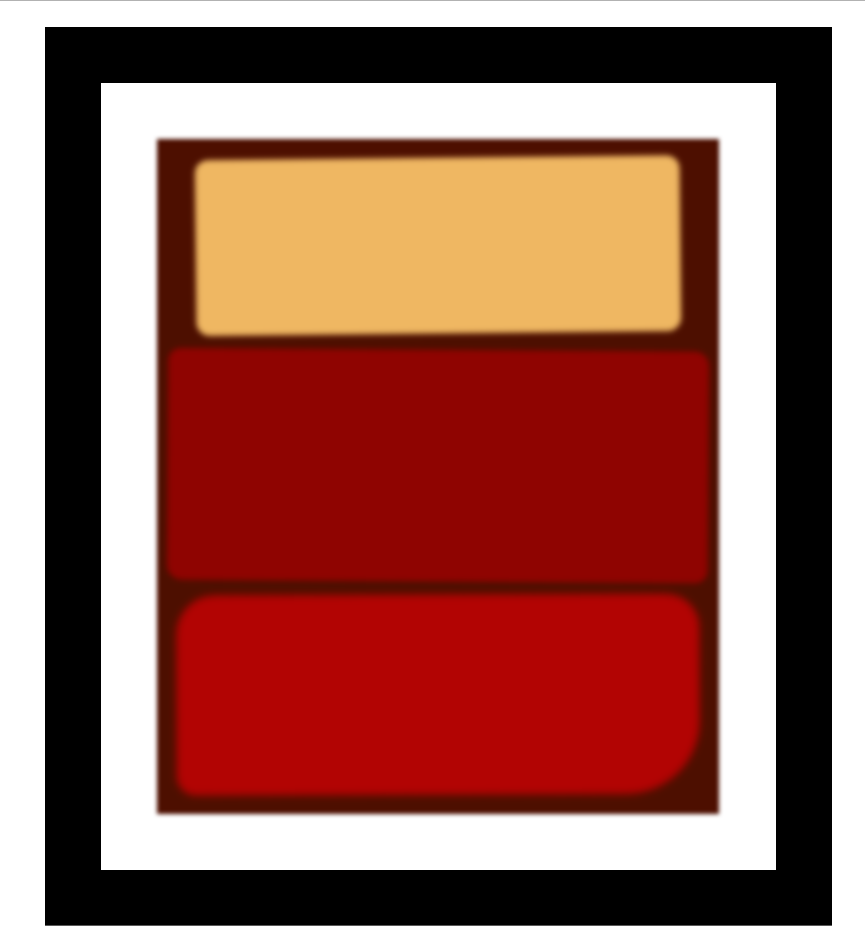

# FreeCodeCamp - Responsive Web Design Certification - Rothko Painting
Project #006

Follow this link for assignment
[Rothko Painting by Free Code Camp](https://www.freecodecamp.org/learn/2022/responsive-web-design/#learn-the-css-box-model-by-building-a-rothko-painting)
                                      
### My notes
Nothing fancy, html, css basics  

